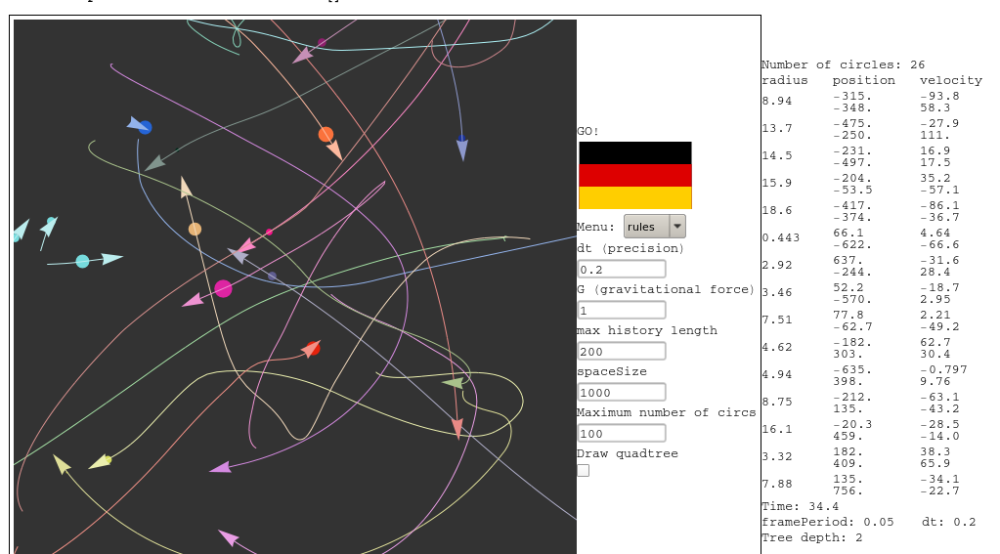

# space-sim

This is a fun little gravity sandbox. You need Mathematica to run it.
Niven Achenjang and I (Luke) built it as a class project at Western Kentucky University
in the spring of 2015.

To run it, evaluate quadtree.nb then project.nb in the same Mathematica notebook.
The interface is at the bottom of project.nb.

If you decide to clone it for your own development, then I suggest you just
shave the top off. Old versions had some very large files:

```
git clone --depth 1 https://github.com/qpwo/space-sim/
```

For detailed info about the project, read `report.pdf`, but here's a little taste:



The physics acts as if everything is in 3d space, but happens to be coplanar.

There's a known bug that our quad tree implementation is useless because the
entire thing is traversed every frame. One day, we will fix it.
